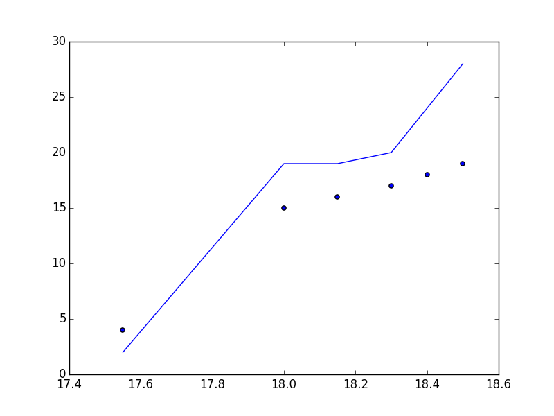
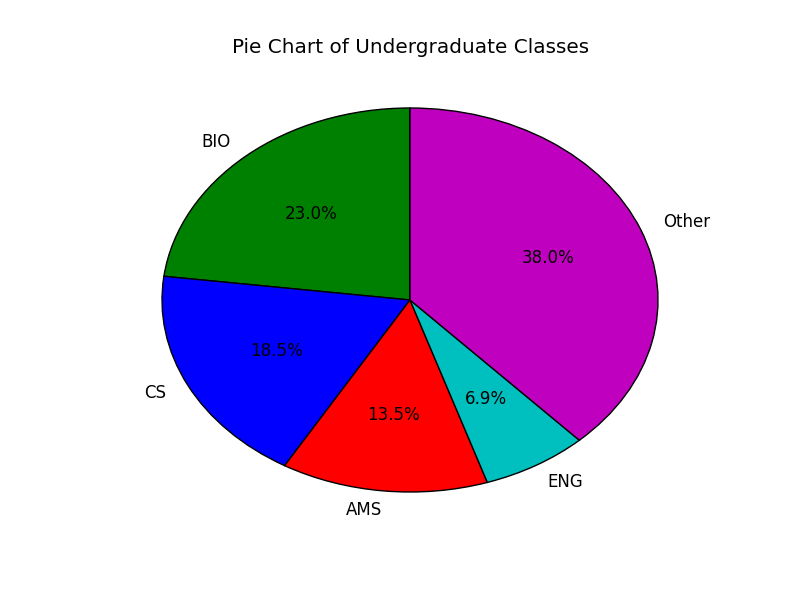
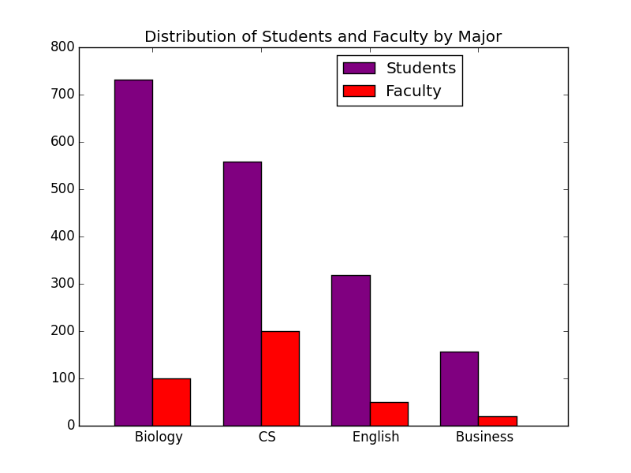

# Introduction to Data Viz With Python

## Co-organized by BMES and SBCS

# Setup

* Python 2.7
* Download Matplotlib
	* Make sure you have pip installed
		* If you don't have pip, check out the guide from last session for instructions to how to install
	* ```pip install matplotlib```
* Download numpy
	* numpy is a library that will help us do simple statistics
	* ```pip install numpy```
* Download the Data [here](https://goo.gl/RJ9QNL)!  
	* Make sure you sign in with your stonybrook email or else you will not be able to access the data


# Overview

## The Importance of Data

Whether you are a Bio major, a CS major, a Linguistics major, or any other major, data plays a huge role. Research is very reliant on the collection and analysis of data. Thus, in order to understand data, we need to learn how to harness and understand data.

There are multiple methods we can use to help us understand our data:

* Data Analysis (Statistics)
	* ex. mean, median, max, min
* Data Visualization
	* Graphs:
		* Line Charts
		* Scatter Plots
		* Bar Graphs
		* Pie Charts


## Benefits of using Python

* Built-in Libraries for:
	* Reading Data from Files
	* Statistical analysis
	* Graphs (Data Visualization)
* Easy to integrate into GUI (Graphical User Interfaces aka application window)
	* We will focus on this at the next Python session.


# Getting the Data

## Data File Formats

* Data can come in multiple formats, most commonly:
	* TSV files - "Tab separated Values"
	* Databases (SQL, MongoDB, etc)
	* **CSV files - "Comma Separated Values"**
		* We will be working with csv files in this session.

### CSV Files

CSV stands for comma separated values. Key concepts to keep in mind about this format are:

* Commas separate each value
* New Lines separate each row of information

So for example, we had an excel table looking like this:

| Major        | # Students |  # Faculty |
| ------------ |:-------------:  | -----:|
| Biology      | 7999  | 134 |
| CS           | 5234        |   123 |
| Other 	     | 12000        |    632 |

In CSV format, this woul convert to the following:

```
Major,# Students,# Faculty
Biology,7999,134
CS,5234,123
Other,12000,632
```


## File Reading  

### Normal File Reading (.txt files) [Extra Info]

On the very rare occasion, you may need to read data from a file that is not in a csv format.  Python has very good features for this.

( Most files can be read this way. For example, png, jpg and other picture file formats are technically just a bunch of ones and zeros and can actually be read as a text file. )

First, in order to read a file, you must open a file. The 'r' parameter denotes that you are opening the file for read access. Other keycodes for opening a file include 'rB', and 'rU'.

```
f = open (filename, "r")
```

Now that you have opened the files, you can read the file.
You can do this by:

```
str = f.read()
```

Note that this function reads the entire file and returns the file in a string, which in this case we save into the variable 'str'. New line characters are denoted as '\n'.

Another common way of reading files is by reading files by lines:

```
str = f.readlines()
```

This returns an list of strings where each string represents a line in your text file.

Lastly, it is always of good coding practice to close the file after using it. This ensures that nothing will be altered in the file accidentally. You can do this by running:

```
f.close()

```


### Reading a CSV File

There are many ways to parse a csv file. However, for simplicity's sake, we will use a python library called csv to parse our values for us.

Let's look at how we can accomplish this:
Note this is the commented version with line by line explanations, scroll down for the uncommented version.

```python
import csv
data = [] # this variable will contain the data
filename = "demo.csv"
# we will open the file and save the file as a variable called csvfile
# rU - keycode for "reading a file with universal NewLine support"
with open(filename, 'rU') as csvfile:
	# parse the file using the reader, our delimiter is set to be a comma
	# (Set the delimiter "\t" if you are dealing with tsv files)
	csvreader = csv.reader(csvfile, delimiter= ",")
	# loop through all the rows in file and append each row to data variable
	for row in csvreader:
		# each row read is an array of strings
		# i.e. ['Biology','7999','134']
		data.append(row)
```

As we are appending rows into a list, we get a two dimensional arrays. Thus, if we run:

`print data `

We should get a data structure similar to this:

```
[
	['Time', ' Num_Bio_Students', ' Num_CS_Students'],
	['17.55', '2', '4'],
	['18.00', '19', '15'],
	['18.15', '19', '16'],
	['18.30', '20', '17'],
	['18.40', '24', '18'],
	['18.50', '28', '19']
]
```

<!--
[    
	['Major','# Students','# Faculty'],
	['Biology','7999','134'],
	['CS','5234','123'],
	['Other','12000,632','632'],
]
-->

#### Code (without comments)

Create a new Python file and add this Code to your  file.

```python
import csv
data = []
filename = "demo.csv"
with open(filename, 'rU') as csvfile:
	csvreader = csv.reader(csvfile, delimiter= ",")
	for row in csvreader:
		data.append(row)

```

## Organizing your data

The format you usually want your data is a simple array of numeric values. For example:

```
[1, 2, 3, 4, 50]
```

Built-in Python commands can then take your arrays and very easily perform simple calcuations with this simple list format. In addition, when we get to data visualization, it becomes crucial that you pass in an list of valid values and that you as the programmer are aware which list is which and which list corresponds to which axis.

Most commonly, especially for scatter and line plots, you will want one array with data for your x-axis and one for your y-axis.
If you want to plot multiple line graphs, the same concept applies. If say, you want your x-axis to represent time, then you just then need another list(s) to represent your y-axis.  


### Fixing your data

Many times, even though you have parse the csv file, the data is not in an ideal shape.
For example, lets look at this data:

```
[
	['# Sample data for simple file manipulation',],
	['# Fun fact: Pythons kill animals by swallowing them in one piece.' ]
	['# Another header we probably don't need to consider while reading our data',],
	['Time', ' Num_Bio_Students', ' Num_CS_Students'],
	['17.55', '2', '4'],
	['18.00', '19', '15'],
	['18.15', '19', '16'],
	['18.30', '20', '17'],
	['18.40', '24', '18'],
	['18.50', '28', '19']
]
```

There are several issues with this data that you may want to consider.

#### Headers

First, notice that there are headers in your data.  
These can be removed from your data variable through the use of list manipulation.

Recall that you can get subsets of your list by indexing your list like so:

```
data = data[3:]
```

This replaces the data variable with the following 2-D list:

```
[
	['Time', ' Num_Bio_Students', ' Num_CS_Students'],
	['17.55', '2', '4'],
	['18.00', '19', '15'],
	['18.15', '19', '16'],
	['18.30', '20', '17'],
	['18.40', '24', '18'],
	['18.50', '28', '19']
]
```

Note, now the unnecessary header comments are removed. We want to keep

`['Time', ' Num_Bio_Students', ' Num_CS_Students']` because this list describes the columns of our data.


You may also have certain columns you may not want to plot such as columns with textual information (i.e. Comments). You should use more list manipulation in order to get rid of these unnecessary fields. This may involve a bit more heavy computation with loops. You may be able to extract these extraneous columns when you parse your csv file.

#### Inverted columns and rows

Another thing to notice, is that getting each columns' data is somewhat complicated. For example, for getting 17.55, you have to go to the second array and grab its first index, while for the next time interval, 18:00, you have to access the third inner array and then grab its first index.

A better way of storing your data would be a list with all the values in each column something resembling this format:

```
[
	['Time', '17.55', '18.00', '18.15', '18.30', '18.40', '18.50'],
	[' Num_Bio_Students', '2', '19', '19', '20', '24', '28'],
	[' Num_CS_Students', '4', '15', '16', '17', '18', '19']
]

```

You can accomplish this by inverting the rows and columns of your 2-D list:

```
data = map(list, zip(*data))
```

Note that if you do not have the same elements in each row or if you neglect to remove any extraneous headers, your 2-D list may not be inverted correctly. Also, note that the order of your inverted list should be preserved.

#### Organizing your column data using a dictionary

You may also improve your data organization by creating a dictionary that relates the column name to the list of values.

We can accomplish this by creating a loop with our previous data. Note, that each column name in this example is the first element of each inner array (let's call each inner array x) . Thus, we can set the key of the dictionary to each inner array x[0], and the value of the dictionary to x[1:] aka the rest of the array.

##### Most Basic Code  :

```
data_dict = { }    # create a dictionary object
for x in data:
	data_dict[x[0]] = x[1:]
```

Output:

```
{
	' Num_Bio_Students': ['2', '19', '19', '20', '24', '28'],
	' Num_CS_Students': ['4', '15', '16', '17', '18', '19'],
	 'Time': ['17.55', '18.00', '18.15', '18.30', '18.40', '18.50']
 }

```

Recall that you can always get the keys of a dictionary by using the function:

```
dictionary_keys = data_dict.keys()
```

#### Cleanup Procedures to consider

Data you get is not always the prettiest. For example, your strings may be read with extra space characters. For instance, ' Num\_Bio\_Students' is not the same as 'Num\_Bio\_Students'.

Thus, it is of your best interest to reformat your data so it is of the right type and of the right expected value.

##### Strings (in particular, column names)

Especially in your dictionary, you would want your keys to be free of extraneous spaces such as ' Num\_Bio\_Students'.
We can use the function "strip()" to accomplish this. This function strips any leading or ending spaces and new line characters from a string. Thus:

```
s = "  Num_Bio_Students  \n" '
print s.strip()  
> Num_Bio_Students
```

This is an optional step, this is highly recommended as it will help you become less likely to confuse what keys a dictionary might have due to some extraneous spaces.

Other things you choose to change may be cases (s.upper(), s.lower()), making the keys all lowercase or uppercase.  

##### Int/Float Casting

In addition, our csv data, as you may have noticed, does not completely convert our values into numbers (ints/floats).
Thus, it might be of our best interest to convert them to integers and floating point numbers so that when we do our data analysis, we may have values that can be correctly and mathematically added together without any errors.
We can accomplish this by casting our strings with:

```
s = "21"
integer_s = int(s)
float_s = float(s)
```

Note that floats are floating point numbers (with decimals) and ints are integers.

It is probably a better idea to float cast your numbers instead of integers because if you divide an integer by an integer you may not necessary get a decimal number. (This is known as integer division.)  You need to have a float in order to assure a value is a decimal value.

For example:

```
2/3 -> 0
2.0/3 -> .66667
```

#### Improved Dictionary Code

```
data_dict = { }    # create a dictionary object
for x in new_data:
	# clean up numeric values in rest of list
	inner_d = []
	# we will loop through the values of our list and convert them to floats
	for y in x[1:]:
		inner_d.append(float(y))
	data_dict[x[0].strip()] = inner_d

print data_dict
```

##### Expected Output:

```
{
	'Num_Bio_Students': [2.0, 19.0, 19.0, 20.0, 24.0, 28.0],
	'Num_CS_Students': [4.0, 15.0, 16.0, 17.0, 18.0, 19.0],
	'Time': [17.55, 18.0, 18.15, 18.3, 18.4, 18.5]
}

```			

### Notes

Note that there may be other things you may have to do to clean up your data, but these noted steps are the most common and crucial steps to ensure that your data is ready for graphing. Especially when you are dealing with large amounts of data, the 'print' statement will no longer be of help to you, so therefore, you should carefully examine your data and their file formats before jumping into code.


It is of your best interest to get your data in some sort of format where you can easily connect the data type or column name to the data and to the other relevant fields. In order words, make sure you can connect your 'x' to your 'y' of your potential graph, and make sure you know what your x and y stand for.

# Data Analytics

## Sums/Maxs/Mins

Getting a sum/max/min of list of data is very simple due to built-in python functions:

* ```s = sum(L)```
* ```m = max(L)```
* ```M = min(L)```

## Simple Stats (with numpy)

Knowing simple statistics about your data such as the mean, median, mode can be very useful. Thankfully, there exist libraries that have functions that easily help you compute these measures.
First, we will import the library numpy at the top of your file.

```
import numpy as np
```

Note, numpy has more functionalities than just mean calcuation, and if you have an interest in data exploration, you should give the documentation of numpy a good look:
[http://docs.scipy.org/doc/numpy/reference/](http://docs.scipy.org/doc/numpy/reference/)


The following functions all take in a list and return out the appropriate number.

#### Mean

```
L = [14,2,3,4,5]
avg_L =  np.mean(L)

## or using the dictionary created in our above steps
avg_bio = np.mean(data["Num_Bio_Students"])
```

#### Median

```
a = np.median(L)
```

#### Standard Deviation

By default, std is calculated by  x.sum() / N.
You can change the formula used (namely N) which is common in statistical practice to N-1 by setting ddof = 1.

```
a = np.std(L) # std over N
a = np.std(L, ddof = 1) # std over N-1
```

#### Variance

By default, variance is calculated by  x.sum() / N.
You can change the formula used (namely N) which is common in statistical practice to N-1 by setting ddof = 1.

```
a = np.var(L) # variance over N
a = np.std(L, ddof = 1) # variance with N-1

```


# Data Visualization (Graphing)

## Understanding and Examining your Data and how it is given to you

Now that you have accessed the data and stored it in some data structure. You can now use your data in graphs. But before we get right into coding and graphing, it is important to look at your data and analyze it. Some key ideas and factors you might want to consider are:

* What data points do you want to plot
	* What do you want on the x axis
	* What do you want on the y axis
* What kind of graph do you want to make?


Make sure you understand the file you are given before proceeding because the following portions assume that you have organized your data and that you can access it with ease.

### Graph Types

There are many types of graphs, and matplotlib has a reasonably informative documentation with examples that you should and may want to use:

We will focus on several of these commonly used charts:

* Line Chart
* Scatter Chart
* Pie Chart
* Bar Chart
* Histogram

## Import the Plotting Library

* MatPlotLib

Before continuing, make sure you import matplotlib on the top of your python file:  (In this case, we will give the library an alias 'plt'. )

```
import matplotlib.pyplot as plt

```

Before plugging our data into our plotting library, make sure you have organized your data in a way so that you can pass in your data to graph.  

## Line Chart and Scatter Plots

Generally, Line and Scatter plots are very useful in showing trends over time, for example, patterns in sound waves, eeg, etc.  

Matplotlib makes the graphing of data very simple, as long as you have very carefully organized your data. Let's say that we have organized our data into this format.

```
our_data = {
   'Num_Bio_Students': [2.0, 19.0, 19.0, 20.0, 24.0, 28.0],
	'Num_CS_Students': [4.0, 15.0, 16.0, 17.0, 18.0, 19.0],
	'Time': [17.55, 18.0, 18.15, 18.3, 18.4, 18.5]
}
```

### Line Chart

The matplotlib function to create a line chart is:

```
plt.plot (x_data, y_data, label="Your Label")

```

Note that you should be placing the list of values you want on your x-axis in the first parameter, the list of values you want on your y-axis in your second parameter, and an optional but recommeded label for your data.

Thus, with the example, we can plot a line relating time to Bio students by:

```
plt.plot (our_data["Time"] , our_data["Num_Bio_Students"], label="Your Label")

```

This will create a plot, but in order for the graph to display, you will need to run the following command:

```
plt.show()
```

Notice that running the 'show' function will make a rather simple GUI, graphical user interface, (application window to pop up). This GUI will allow you to save your chart, but it might be worth noting that there is a bug in the GUI in that you may not be able to rename your file, although you can choose the folder you save your file in.


### Scatter Plot

The Scatter Plot syntax is the same as the line chart, except instead of using 'plot',  you need to call 'scatter'.

```
# Syntax : plt.scatter (x_data, y_data, label="Your Label")
plt.scatter(our_data["Time"], our_data["Num_CS_Students"], label = "Num_CS")
```

### Multi-plots

You can also have several plots on one graph window. Thus, for example, if you wanted a line and a scatter plot on the same graph, you can run the following to get the following graph.

```
plt.plot(our_data["Time"], our_data["Num_Bio_Students"])
plt.scatter(our_data["Time"], our_data["Num_CS_Students"])
plt.show()
```


### Labels and Legend and other Chart Improvements

Now that we have plotted our data, it would be a very good idea for us to give labels to the graph.
We can do this by rendering a legend for the graph before showing the plot.

```
plt.legend(bbox_to_anchor=(.2, 1), loc=2)
```
bbox-to-anchor takes in a tuple representing the coordinates (x and y) that the  top right hand side of your rectangle will be drawn to.


You can also label your axises and title your graph:

```
plt.plot(our_data["Time"], our_data["Num_Bio_Students"], label = "Num_Bio")
plt.plot(our_data["Time"], our_data["Num_CS_Students"], label = "Num_CS"))

plt.legend( bbox_to_anchor=(.4, 1))
plt.xlabel("Time (day) ")
plt.ylabel("Number of Students (#)")
plt.title("Number of Students Attending Data Viz Seminar")
plt.show()

```

You can also change the color and the markers of your graphs. For instance, your line graph can use red markers that look like triangles if you run:

```
plt.plot(our_data["Time"], our_data["Num_CS_Students"], c='r', marker='^', label = "Num_CS")
```

Check out the following two links for a complete list of colors and markers that can be used in scatter plots and line charts:

* [Colors](http://matplotlib.org/api/colors_api.html)
* [Markers] (http://matplotlib.org/api/markers_api.html)


### Example Plot with Code

#### Plot


#### Code

```
plt.plot(our_data["Time"], our_data["Num_Bio_Students"], label = "Biolgy Major")
plt.scatter(our_data["Time"], our_data["Num_CS_Students"], c='r', marker="^", label = "CS Major")
plt.legend( bbox_to_anchor=(.4, 1))
plt.xlabel("Time (day) ")
plt.ylabel("Number of Students (#)")
plt.title("Number of Students Attending Data Viz Seminar")
plt.show()
```


## SubPlots
Sometimes, it will be very useful to stack plots on the y or the x-axis.
We can do this by creating subplots. Subplots are plotted the same way as when you plot one plot, but you will have to refer to the variable containing a specific subplot.
You can create 2 subgraphs sharing the x-axis this by:

```
f, (ax1, ax2) = plt.subplots(2, sharex=True)
```

If you replace sharex with sharey, the y-axis will instead be shared by the 2 subplots.

Note that you need the f variable as plt.subplots returns several values, and although we may not use f, which holds a matplotlib figure, it will throw an error if you do not provide enough variables to hold the return value of the subplot function.

(ax,ax2) is a tuple (a fixed list) where ax is the first subplot and ax2 is the second subplot. Now we can plot normally like this:

```
ax1.plot(our_data["Time"], our_data["Num_Bio_Students"])
ax2.plot(our_data["Time"], our_data["Num_CS_Students"], c='r', marker="^")
```

Unlike plotting one graph, you will need to use different functions in order to set the x and y limits, the title and axes labels.

```
ax1.set_ylim([0,30])
ax2.set_ylim([0,25])
ax1.set_title("Biology")
ax2.set_title("CS")
ax1.set_ylabel("# Students")
ax2.set_ylabel("# Students")
ax2.set_xlabel("Time")
```

If we now show this graph, we now get a graph with two subplots sharing the x-axis.
![SubPlots] (subplot_lines.png)

This can be very useful in comparing different brain waves without cluttering a plot.

## Pie Chart

Pie charts rendered in matplotlib have a slightly different function format than line and scatter graphs.

```
# Syntax : plt.pie (values, labels=labels,autopct='%1.1f%%' )
```

Due to the lack of axises in a pie chart, you no longer need to pass in two lists with data.
In addition, the autopct parameter represents how you want to format the pie chart's percentages. If you omit this, no percentages will be drawn on your graph.

```
datavalues = [333, 268,195,100,550]
labels = ["BIO", "CS", "AMS", "ENG", "Other"]
colors = ['g','b', 'r', 'c', 'm']
plt.pie(datavalues,  labels=labels, colors=colors,
        autopct='%1.1f%%')
plt.title ("Pie Chart of Undergraduate Classes ")
plt.show()
```

There are other options that will alter how your pie chart looks, which can be found in the documentation!




## Bar Chart

The syntax for bar graphs is slightly different from other graphs.
The matplotlib function to create a bar chart is:

```
plt.bar (x-coordinates, y-data, label="Your Label")

```

Note, that unlike the other charts you need to give it x positioning coordinates. The way to think about these coordinates is that every bar should be separated by evenly spaced value. (Use 1 for simplicity)
Example Graph using the following data:

```
values = [ 732, 558, 319, 157]
xticks = [  "Biology", "CS", "English", "Business"]
r =  range (len(values) )
# r = [0,1,2,3,4] since len(values) = 4
# built in function that creates a list of integers from a certain range of integers

```

Now that we have calculated some x-coordinates for our data, we can now plot. Note that unlike line and scatter plots, we will need to label our x-axis manually since "Biology" and "CS" are not numeric values.

```
plt.bar(r, values,  color ="purple", align='center');
plt.xticks (r, xticks)
plt.show()
```

We can also make multi-bar graphs. However, this will take a bit more effort since we will need to reposition the bars for a bit more space to allow the secondary bars to display.

We will accomplish this by setting widths to our bars.  Think of width as what scale factor of your bars.  matplotlib will calculate your bar width for you (total space a bar can be, but you need to give it a factor to scale it

```
fac = [100,200, 50,20]
rr = [z+0.35 for z in r]
# we will add 0.35 (the width of the first bar) to get our second bar's position

plt.bar(r, values, width=0.35, color ="purple", align='center', label = "Students");
plt.bar(rr, fac,width=0.35,  color ="red", align='center', label="Faculty");
plt.xticks ([d -.35/2 for d in rr], xticks)
plt.legend(bbox_to_anchor=(.8, 1))
plt.title("Distribution of Students and Faculty by Major")
plt.show()

```



## Histogram
Recall that Histograms are charts that relate frequency of data points.
Thus, for example, if you have data that looks like this:

```
L = [13, 4, 5, 17, 5, 7, 10, 6, 19, 2, 2, 2, 3, 12, 15, 18, 9, 14, 14, 20, 2, 3, 20, 9, 15, 12, 6, 19, 20, 8,15, 12, 6, 19, 20, 18, 17, 20, 16]
```

You can create the histogram by using:

```
plt.hist(L, bins=[0,5,10,15,20])
plt.show()
```

The 'bins' parameter denotes the class intervals.


## More Features & Graphs

* There are so many more things we can do with plots under the matplotlib library.
* For more details on dfferent parameters you can use to optimize and prettigy your graphs, refer to the pyplot [documentation](http://matplotlib.org/api/pyplot_api.html).
